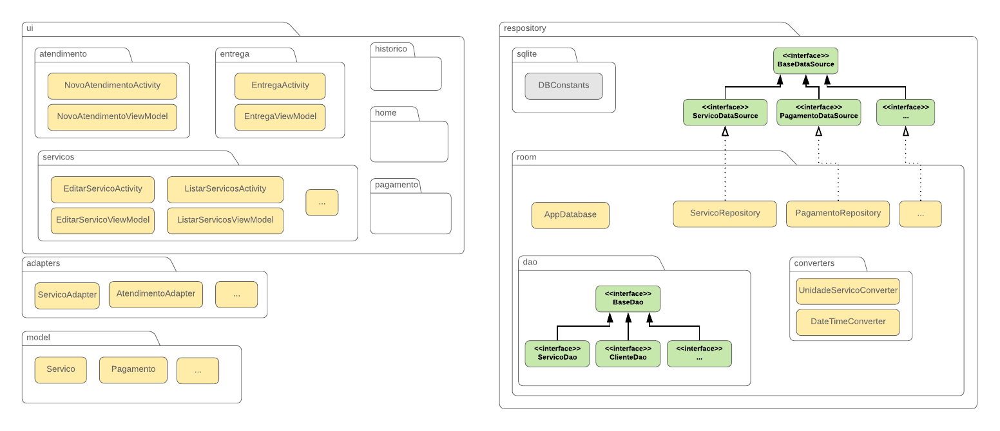
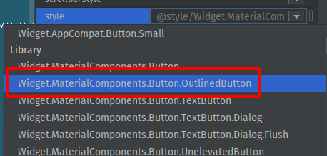
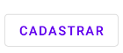
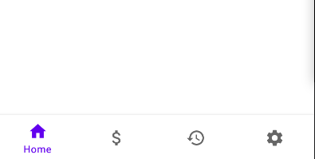
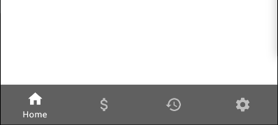

# mypay-template
Template das Soluções do MyPay

## Primeiros Passos

- Renomear projeto para corresponder ao da sua equipe
  - Selecionar pacote "br.uea.transirie.mypaytemplate2"
  - No menu superior, Refactor => Rename ou "Shift + F6"
  - Abrir `res/values/strings.xml` e renomear "app_name"
  - Renomear pasta do projeto de "MyPayTemplate" para o nome do seu
- Ler esse documento checando o código

## Configurações Prontas

- Suporte a viewBinding
  - https://developer.android.com/topic/libraries/view-binding
- Biblioteca Room
  - https://developer.android.com/training/data-storage/room
- Suporte a `java.time` com desugaring
  - https://developer.android.com/studio/write/java8-support


- Coroutines

  - https://developer.android.com/kotlin/coroutines


- Lib da maquininha comentada

  - Descrição de como adicionar no final desse documento
  - No código tem comentários em todos os pontos onde precisa alterar
- Tema com Material Design

  - Comentários explicativos no arquivo `res/values/themes.xml`
  - Algumas cores já estão configuradas em `res/values/colors.xml`

---

## Arquitetura



- Seguindo um subconjunto da [Clean Architecture](https://blog.cleancoder.com/uncle-bob/2012/08/13/the-clean-architecture.html), dividimos as classes em pacotes `ui`, `adapters`, `repository` e `model`
- Versão simplificada do MVVM é aplicada
  - cada Activity, caso lide com dados do banco, deve ter uma classe `ViewModel`
  - Checar `ui/servicos/EditarServicosViewModel`

---

## Códigos de Exemplo

### Home: Bottom Navigation

- Localização: `ui/home/HomeActivity`
- Demonstra como usar o bottom navigation com fragmentos

### Ajustes: fragmento com comportamento
- Localização: `ui/home/AjustesFragment`
- Rodando o app, aperte em "Serviços Cadastrados", abrirá a Activity `EditarServicosActivity`

### Customização de Tema

- Fragmento: `ui/home/HomeFragment.kt`
- Layout: `res/layout/fragment_home.xml`
- Tema customizado: `res/values/themes.xml`, em "OUTLINED BUTTON"
- O "style" do botão é configurado para "outlinedButton.Red" e, em `themes.xml`, escolhemos as cores
  - Esse estilo pode ser reaproveitados em outros botões

### Lista de Serviços

- Activity: `EditarServicosActivity`
- Foi implementado uma tela de edição de serviços
- Rodando o app, vá em "Ajustes" e "Serviços Cadastrados"
- O callbak para cada evento de clique fica na Activity
- Verifique como o viewModel é usado
- Veja como implementar o RecyclerView usando `viewBinding` no adapter `adapters/ServicoAdapter` 

----

## Recomendações de Implementação

### Componentes

- Ao adicionar QUALQUER componente, utilizar o correspondente na biblioteca do **Material Design**
  - NÃO apenas clicar e arrastar
  - Consultar https://material.io/components?platform=android
    - após escolher o componente, ver aba "implementation"
  - Ex: não usar `Button`, trocar por `*com.google.android.material.button.MaterialButton*`
    - https://material.io/components/buttons/android#using-buttons

### Cores e Estilos

- Evitar definir cores direto no componente, usar cores de algum estilo
  - Ver comentários em `res/values/themes/themes.xml`
  - Checar quais estilos estão disponívei no site material.io para o componente
  
- Ao definir novas cores, fazer referência a cor e não ao elemento

  - Evitar: `backgroundColorBottomMenu` para cor do menu inferior
  - Preferir: `menu_gray`
  
- Sempre que for modificar o estilo, seja na forma ou cor, checar no site se não existe um estilo padrão

  - Ex.: Um botão sem fundo, apenas com borda, deve usar o estilo `materialButtonOutlinedStyle`

    ```xml
    <Button
        android:id="@+id/outlinedButton"
        ...
        style="?attr/materialButtonOutlinedStyle"
    />
    ```

     |  |
    --------------------------------------------|-------|
                                                |       |
    
  - Para customizá-lo, vemos no site que a linha é definida por `colorOnSurface` e o texto por `colorPrimary`, que no template tem um exemplo de customização

### Dimensões dos Componentes

- Na maioria dos casos, definir dimensões com variáveis
- Use o arquivo `res/values/dimens.xml` para ir criando as variáveis
  - Mantenha o arquivo organizado, separando dimensões por categorias e comentários
- Valores muito específicos a uma única tela podem ser colocados diretamente
- Ex. 1: largura padrão de todos os componentes
- Ex. 2: largura de botões de caixas de diálogo (*dialogs*)

### Tipografia: Dimensões das Fontes

- Use sempre uma dos estilos de fonte definidos oficialmente

  - Lista de todos: https://material.io/develop/android/theming/typography
  - Ex. Para textViews de título, usar `textAppearanceHeadline1`, 2, 3... o que for melhor

- Se nenhuma fonte padrão for suficiente, customize como indicado no site

  - Crie um estilo em `theme.xml` e usá-lo em todos os componentes

  - Ex. para uma fonte igual à subtitle 1, mas com tamanho menor:

  - Defina um estilo (escolhi o nome `text.subtitle1`) que estende o padrão `Headline1`

    ```xml<style name="text.subtitle1" parent="TextAppearance.MaterialComponents.Headline1">
    
      ...
      <item name="android:textSize">14sp</item>
      ...
    </style>
    ```

  - E depois configure no tema principal para que globalmente "subtitle 1" use essa definição

    ```xml
    <item name="textAppearanceSubtitle1">@style/text.subtitle1</item>
    ```

    


### Exemplo de customização de Estilo

- Caso realmente deseje customizar a cor de um componente fora do padrão, é recomendado sobrepor as cores do tema para aquele componente específico

- Suponha que deseja-se customizar o componente BottomNavigationView

  - https://material.io/components/bottom-navigation/android

- Olhando no site, vemos que para mudar a cor de fundo, usaríamos a propriedade `app:backgroundTint` diretamente no layout (xml) da tela, assim:

  ```xml
  <com.google.android.material.bottomnavigation.BottomNavigationView
      android:id="@+id/idDoComponente"
  	app:backgroundTint="@color/nomeDaCor"
  	... />
  ```

- Mas o ideal é definir no arquivo `res/values/themes.xml`, sobrepondo a cor padrão dele

- Vemos no site que o estilo padrão é `Widget.MaterialComponents.BottomNavigationView`

- Para facilitar, vamos usar o estilo colorido, `BottomNav..Colored`

- As cores padrão são:

  - background (container): `colorPrimary`
  - Ícone e texto (inativo): `colorOnPrimary` 60%
  - Ícone e texto (ativo): `colorPrimary`

- Se olharmos no `themes.xml`, já temos elas definidas globalmente para o app:

  ```xml
  <style name="AppTheme" parent="Theme.MaterialComponents.DayNight.DarkActionBar">
      ...
      <!-- Primary brand color. -->
      <item name="colorPrimary">@color/purple_500</item>
      ...
      <item name="colorOnPrimary">@color/white</item>
      ...
  </style>
  ```

- Vamos criar um estilo especificamente para a barra de navegação inferior

- Para isso, configuramos a propriedade `materialThemeOverlay`, tomando como referência (parent), o estilo colorido de bottom navigation assim como definindo no site

  ```xml
  <style name="bottomNavigation" parent="Widget.MaterialComponents.BottomNavigationView.Colored">
      <item name="materialThemeOverlay">@style/ThemeOverlay.bottomNavigation</item>
  </style>
  ```

- Agora iremos personalizar as cor primária

  ```xml
  <style name="ThemeOverlay.bottomNavigation" parent ="">
      <item name="colorPrimary">@color/menu_gray</item>
      <item name="colorOnPrimary">@color/white</item>
  </style>
  ```

- Esse é o resultado, primeiro com `BottomNavigationView`, depois com `BottomNavigationView.Colored` personalizado

  |  |  |
  | ---------------------------------------------------- | --------------------------------------------------- |
  |                                                      |                                                     |


---

## Como Implementar um Módulo

Suponha que você deseja implementar uma tela de "login"

### 1. Activity

1. crie um novo pacote (pasta) dentro de `ui` chamado `login`

2. Crie uma nova `Activity` (pode usar também um `Fragment`)

3. Adicione os métodos da Activity que você acha que existirão para atualizar a interface
   - ex. `mostrarErroLogin()`

### 2. Model

- Crie as entidades que serão necessárias dentro do pacote `model`
  - ex. `Usuario()`
  - para isso, defina o nome da tabela no arquivo `DBConstants.kt`, do pacote `repository/sqlite` seguindo o padrão `TABLE_...`
  - também acrescente os nomes das tabelas da entidade caso já não exista. Se um nome de coluna (ex. `COLUMN_ID`, ou ainda `COLUMN_DESCRICAO`) já estiver lá, reaproveite. Vamos usar como se fosse o "res/values/strings"
  - Agora termine de criar o model definindo as propriedades (e nomes de colunas), relações, conversões de tipo, etc.

### 3. DataSource: Interface do Repositório

- definem um "contrato" de consulta/armazenamento independente de ser Room ou outro meio de acesso
- Na classe Repository correspondente serão implementados
- Crie uma interface de repositório para cada entidade, elas serão usadas simultaneamente pelo armazenamento local e remoto
  - estenda da interface "BaseRepository", que já inclui os métodos básicos de CRUD
  - Inicialmente usaremos apenas o Room, logo teremos implementações do repositório apenas como "Entidade...RoomRepository"
  - Para cada interface, coloque todos os métodos que serão necessários para alterar cada tabela. Você poderá adicionar novos depois e não precisa definir todos os métodos para todas as entidades, mas pode começar com o CRUD básico para todas.
  - Exemplo na definição de Atendimento: buscar pelo id do cliente
  - Esses métodos ficam evidentes após fazer o diagrama de sequências e aqui bastaria "copiar" de lá
  - Você pode definir métodos "search" se acha que será necessário buscar por nome ou substrings...
### 4. DAO

- Crie um DAO para cada entidade, deve estender o "BaseDao"
  - o BaseDAO já inclui o CRUD básico
- Adicione o método abstrato no AppDatabase

### 5. Repositório do Room: Implementação

- Crie as implementações de cada repositório usando o Room no pacote `repository/room`

  - Todas implementarão as respectivas interfaces de repositório já criadas

### 6. ViewModel

- Não implementaremos o ViewModel completo do MVVM, essa classe será apenas usada para separar a lógica de negócio e acesso ao banco da interface (View ou Activity)
- Crie o ViewModel no mesmo pacote da Activity

------

## Preparar Lib da Maquininha

- Extrair arquivo .zip em utils/printer, ficando assim:

```
utils
└── libprinter
	├── base
	├── enums
	├── MainActivity.kt
	├── models
	├── printer
	└── utils
```

- Alterar em app/build.gradle

  - descomentar as linhas do ndk:

    ```
    android {
    	...
    	ndk {
    		abiFilters "arm64-v8a", "armeabi-v7a", "x86", "x86_64"
    	}
    	...
    }
    ```

  - descomentar as referências a arquivos da lib
    ```
    dependencies {
    	...
    	implementation fileTree(dir: "libs", include: ["*.jar"])
    	implementation files('libs/easypaymentpos-debug.aar')
    	api files('libs/PPCompAndroid-v1.45.aar')
    	implementation files('libs/receipt-release.aar')
    	...
    }
    ```

- Alterar em build.gradle (do projeto)

  - descomentar linha 20

    ```
    flatDir { dirs 'libs' }
    ```

- Alterar em gradle.properties

  - descomentar linha 23

    ```
    android.useDeprecatedNdk=true
    ```

